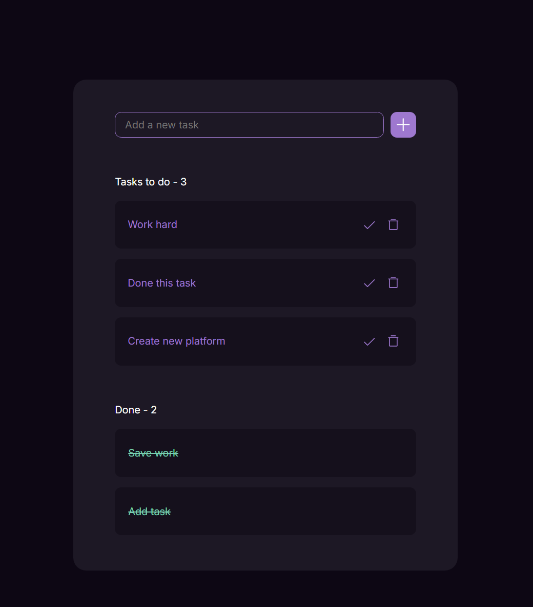

# To do list site

This project was created with HTML, CSS, and JS. Here I used localstorage for saving tasks and done tasks. You can add new tasks that you need to do, check that you've done the task, and delete the task. You can see how many tasks do you have and how many you've done.

[Design from figma](<https://www.figma.com/design/bOOhfnhO4Hnw6BTnRFaf0Q/Todo-App-(Community)?node-id=1-184&node-type=frame&m=dev>)
